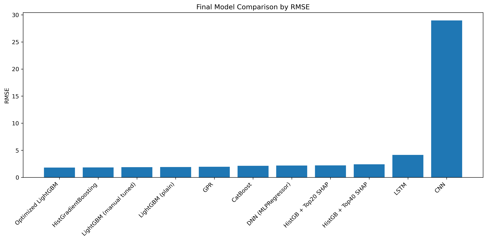
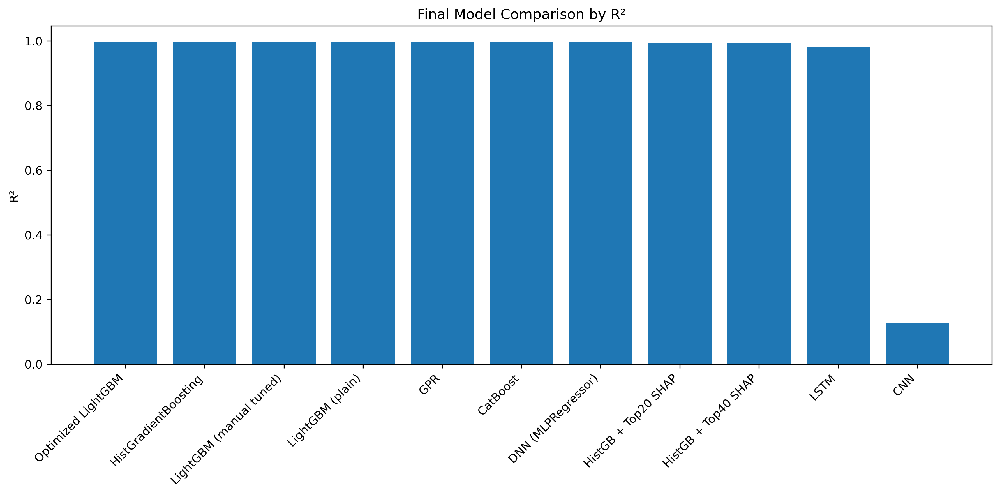
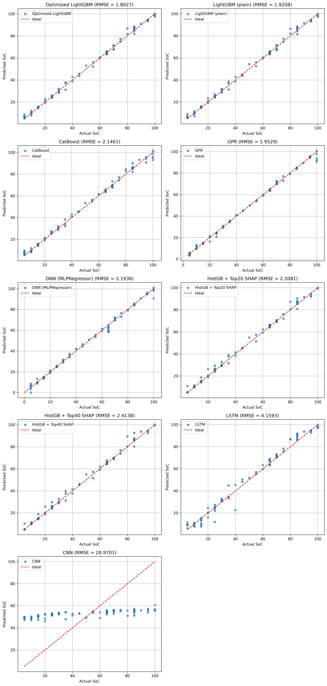
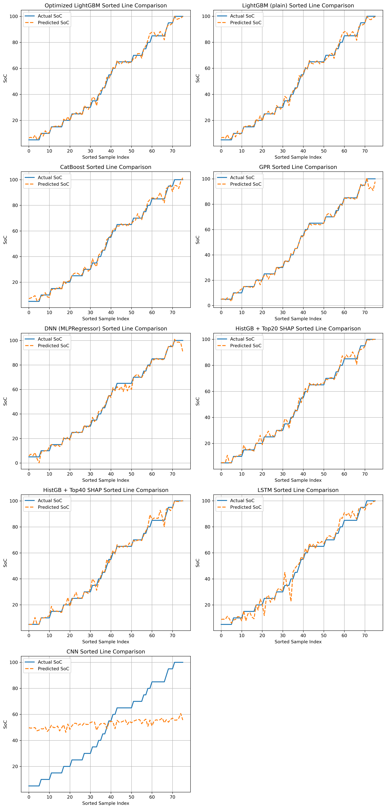

# Battery SoC Prediction using EIS Data and Machine Learning

This project focuses on predicting the State of Charge (SoC) of lithium-ion batteries using Electrochemical Impedance Spectroscopy (EIS)-based data and machine learning models.

The main objective was to build a complete data-driven workflow for SoC estimation by converting frequency-dependent EIS measurements into spectrum-wise samples and comparing different machine learning and deep learning models.

---

## Project Motivation

Accurate battery SoC estimation is important for battery management systems, electric vehicles, energy storage systems, and renewable energy applications. Traditional SoC estimation methods often require detailed electrochemical models or complex experimental calibration. In this project, a machine learning-based approach was used to estimate SoC from EIS-related features such as resistance, reactance, voltage, and frequency response.

---

## Dataset Description

The original dataset contained EIS-based measurements with the following columns:

- `Frequency(Hz)`
- `R(ohm)`
- `X(ohm)`
- `V(V)`
- `SoC(%)`

For easier processing, the columns were renamed as:

- `freq`
- `R`
- `X`
- `V`
- `SoC`

The dataset structure was:

- 20 unique SoC levels
- 28 frequency points
- 19 repeated measurements for each SoC-frequency pair
- 10,640 original data rows
- 380 final spectrum-wise samples

---

## Data Preprocessing

The original row-wise data was converted into a spectrum-wise dataset.

For each SoC level and repeat ID, all 28 frequency points were arranged into one row. Therefore, each final sample represents one complete EIS spectrum.

The final input feature size was:

```text
380 samples × 84 features
```

where:

```text
84 features = 28 R values + 28 X values + 28 V values
```

The final target variable was:

```text
SoC(%)
```

---

## Project Workflow

The complete workflow followed in this project was:

1. Load the original EIS dataset
2. Rename columns for easier coding
3. Sort the data by SoC and frequency
4. Create repeat IDs for repeated measurements
5. Convert row-wise EIS data into spectrum-wise samples
6. Create final feature matrix using R, X, and V values
7. Split the dataset into training and testing sets
8. Train multiple machine learning models
9. Train deep learning models for comparison
10. Evaluate all models using error metrics
11. Apply SHAP analysis for feature importance
12. Perform hyperparameter tuning for LightGBM and HistGradientBoosting
13. Compare all models using tables and graphs
14. Select the best-performing model

---

## Models Used

The following models were tested:

- Random Forest Regressor
- Extra Trees Regressor
- Gradient Boosting Regressor
- AdaBoost Regressor
- HistGradientBoosting Regressor
- XGBoost Regressor
- LightGBM Regressor
- CatBoost Regressor
- Gaussian Process Regressor
- DNN / MLP Regressor
- CNN
- LSTM
- Transformer-based model

---

## Evaluation Metrics

The models were evaluated using:

- Mean Absolute Error (MAE)
- Mean Squared Error (MSE)
- Root Mean Squared Error (RMSE)
- Coefficient of Determination (R²)

RMSE was mainly used for comparison because it shows prediction error directly in SoC percentage units.

---

## Final Model Performance

The optimized LightGBM model gave the best overall result.

| Model | RMSE | R² |
|---|---:|---:|
| Optimized LightGBM | 1.8027 | 0.9966 |
| HistGradientBoosting | 1.8461 | 0.9965 |
| LightGBM Manual Tuned | 1.8854 | 0.9963 |
| LightGBM Plain | 1.9208 | 0.9962 |
| Gaussian Process Regressor | 1.9529 | 0.9960 |
| CatBoost | 2.1461 | 0.9952 |
| DNN / MLPRegressor | 2.1936 | 0.9950 |
| HistGB + Top-20 SHAP Features | 2.2081 | 0.9949 |
| HistGB + Top-40 SHAP Features | 2.4138 | 0.9939 |
| LSTM | 8.0561 | 0.9326 |
| Transformer | 16.0177 | 0.7334 |
| CNN | 25.3463 | 0.3325 |

---

## Key Findings

Tree-based ensemble models performed better than deep learning models for this dataset.

The optimized LightGBM model achieved the lowest RMSE and highest R² value. HistGradientBoosting also showed very strong performance.

Deep learning models such as CNN, LSTM, and Transformer did not perform as well as the tree-based models. This may be because the dataset size was relatively small for deep learning models.

SHAP analysis was used to understand feature importance and to test whether fewer important features could maintain good prediction performance.

---

## Important Figures

### Final RMSE Comparison



### Final R² Comparison




### All Models Actual vs Predicted



### All Models Sorted Line Comparison



---

## Repository Structure

```text
battery-soc-prediction-eis-ml/
│
├── README.md
├── requirements.txt
├── SoC_prediction.ipynb
│
├── data/
│   ├── combined_with_SoC_from_filename.csv
│   └── Final_spectrum_dataset.csv
│
├── figures/
│   ├── final_model_rmse_bar.png
│   ├── final_model_r2_bar.png
│   ├── actual_vs_predicted_all_models.png
│   ├── Sorted_line_comparison.png
│   ├── all_models_actual_vs_predicted.png
│   └── all_models_sorted_line_comparison.png
│
└── results/
    └── final_model_comparison_table.csv
```

---

## Files Description

- `SoC_prediction.ipynb`  
  Main notebook containing preprocessing, spectrum-wise dataset creation, model training, evaluation, SHAP analysis, tuning, and visualization.

- `data/combined_with_SoC_from_filename.csv`  
  Processed EIS dataset with SoC labels.

- `data/Final_spectrum_dataset.csv`  
  Final spectrum-wise dataset used for model training.

- `results/final_model_comparison_table.csv`  
  Final comparison table of all tested models.

- `figures/`  
  Folder containing saved model comparison graphs and prediction plots.

---

## How to Run

Install the required libraries:

```bash
pip install -r requirements.txt
```

Then open the notebook:

```bash
jupyter notebook SoC_prediction.ipynb
```

Run the notebook cells step by step.

---

## Tools and Libraries Used

- Python
- Pandas
- NumPy
- Matplotlib
- Seaborn
- Scikit-learn
- XGBoost
- LightGBM
- CatBoost
- SHAP
- TensorFlow / Keras
- Jupyter Notebook

---

## Conclusion

This project presents a complete machine learning workflow for lithium-ion battery SoC prediction using EIS-based features. The results show that optimized tree-based ensemble models, especially LightGBM and HistGradientBoosting, can predict SoC with high accuracy for this dataset.

The project also compares classical machine learning models, boosting models, SHAP-based feature selection, and deep learning models within the same workflow.

---

## Note

This is a research-oriented machine learning project. The results are based on the available dataset and train-test split. Further improvement can be done using larger datasets, better validation strategies, and real-time battery management system testing.
